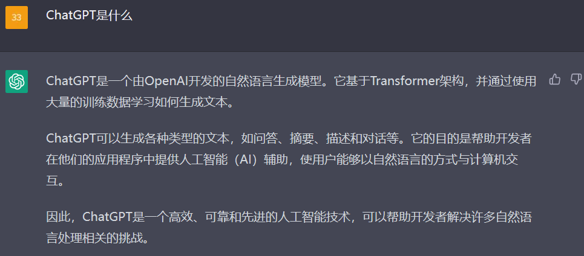
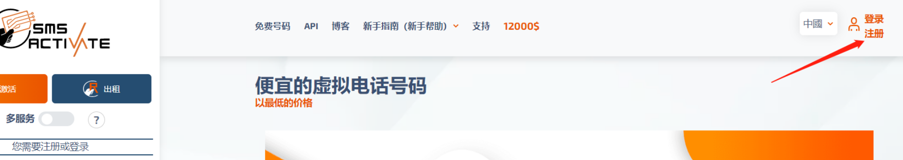
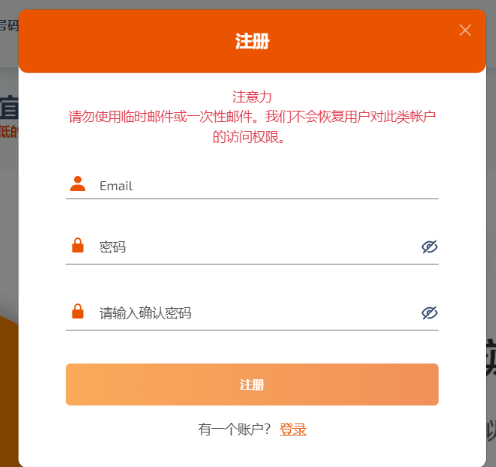
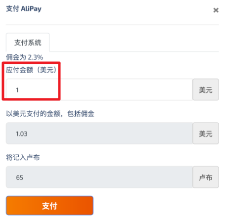
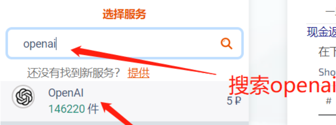
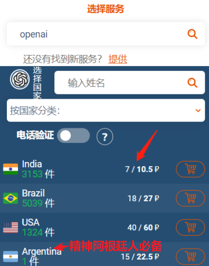
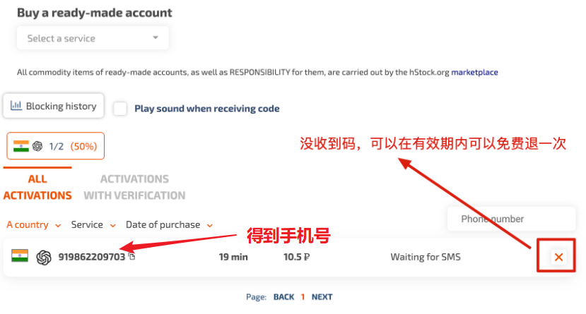
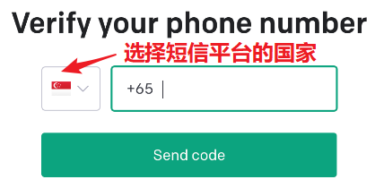

# ChatGPT中国大陆的全方面教程

Star✨过10，更新魔法冲浪全教程。

&nbsp;

## ChatGPT概念

全称 ： **C**hat **G**enerative **P**re-trained **T**ransformer

官方回答

**用途：**

- 快速生成合适准确的八股文答案、算法代码等...

- 写一封辞职信，体面离职（doge
- 扮演严肃的脱口秀喜剧演员
- 利用它丰富的训练文本，查询到Baidu无法查询的外网知识。

**备注：**

> ChatGPT使用截止到2021年的文本进行训练，因此在此之后的事件它无能为力，还有中文互联网上的一些梗，你问它只会得到更离谱的答案🤪。

&nbsp;

## 注册准备

官网： https://chat.openai.com/

准备：可以访问`OpenAI` 官网，但ChatGPT未对中国大陆开放，且需要境外手机号才能注册，因此需要魔法伪装为境外用户，费用一般<=1刀乐。

备注： 注册并成功进入 ChatGPT 后，无需联网即可正常对话。 在 Cookie 有效情况下，之后可能直连进入。

&nbsp;

## 正式注册

### 1. 虚拟手机号注册

&nbsp;

境外虚拟手机号短信平台 https://sms-activate.org/ ，右上角注册。

用个人邮箱，注册<u>短信平台</u>账号

登录短信平台后，右上角 **充值** ，支付宝付款。

1 Dollar足矣。

左侧搜索 OpenAI 并选中，出来很多国家，价格不同，选喜欢的，然后打钱

去 OpenAI 使用该手机号发验证码。

&nbsp;
### 2. 注册OpenAI账号

&nbsp;

翻山越岭之后，打开 https://beta.openai.com/signup 进行注册，不翻山的话会被查到是大陆用户。

> OpenAI's services are not available in your country.

选你买的国家

用第二步的手机号发验证码

### 3.  手机号接码，填入OpenAI

&nbsp;

可以愉快玩耍了

&nbsp;

## **镜像网站**
&nbsp;

无需魔法，无需注册，可以直接访问，体验与 ChatGPT 功能一样，但服务可能不稳定，访问人数多时会失效。

- https://chat.forchange.cn
- http://wenzhang.zhuluan.com/zh-cn
- http://chat.h2ai.cn
- https://yy.yy.sbs
- http://119.91.201.57:3000

&nbsp;

## 类似应用
&nbsp;

名称：[YouChat](https://you.com)

简介：输入内容搜索后，点击“Chat”一栏即可使用，它是目前少数能稳定多次运行的在线应用 👍。

名称：[BingChat](https://bing.com/new)

简介：微软推出的 ChatGPT 应用，但目前还在测试阶段，需要申请“WaitList”。

&nbsp;

## **浏览器扩展**
&nbsp;

名称：[ChatGPT for Google](https://github.com/wong2/chat-gpt-google-extension)

下载：[Firefox](https://addons.mozilla.org/zh-CN/firefox/addon/chatgpt-for-google)、[Chrome](https://chrome.google.com/webstore/detail/jgjaeacdkonaoafenlfkkkmbaopkbilf)、[本地下载](https://www.crxsoso.com/webstore/detail/jgjaeacdkonaoafenlfkkkmbaopkbilf)、[脚本版](https://greasyfork.org/zh-CN/scripts/456077)

简介：在搜索引擎里界面显示 ChatGPT 结果，需要登陆 Chat 帐号。

名称：[Merlin](https://merlin.foyer.work/onboarding/)

下载：[Chrome](https://chrome.google.com/webstore/detail/merlin-openai-chatgpt-pow/camppjleccjaphfdbohjdohecfnoikec)、[Firefox](https://addons.mozilla.org/zh-CN/firefox/addon/merlin-chatgpt-on-browser/)、[本地下载](https://www.crxsoso.com/webstore/detail/camppjleccjaphfdbohjdohecfnoikec)

简介：免登陆，每天 11 次。

名称：[ChatGPT-ToolBox](https://github.com/bigemon/ChatGPT-ToolBox)

简介：保存 ChatGPT 生成对话的小工具，方法是通过“小书签”开启使用。

名称：[ShareGPT](https://sharegpt.com/)

简介：一键分享 ChatGPT 对话。

名称：[WebChatGPT](https://github.com/qunash/chatgpt-advanced)

简介：当 ChatGPT 没有结果时，显示 Google 搜索引擎的结果。

&nbsp;

&nbsp;
## 手机应用
&nbsp;

名称：[Poe](https://poe.com/) 

简介：Poe 是问答社区 Quora 旗下的一款 AI 问答应用，目前完全免费，但目前只有 iOS 版。

名称：[Bing](https://apps.apple.com/us/app/microsoft-bing-search/id345323231?uo=4&at=11l6hc&app=itunes&ct=fnd)

简介：由微软推出的 ChatGPT 应用，目前使用美版 Bing App，可直接使用。

## **桌面应用**

&nbsp;

名称：[Chatgpt](https://github.com/lencx/ChatGPT)

简介：支持 Mac、Windows、Linux 三个平台。

名称：[ChatGPT Mac](https://github.com/vincelwt/chatgpt-mac)

简介：在状态栏打开 ChatGPT，目前只支持 Mac

&nbsp;
## 使用技巧
&nbsp;

下面这些网站收集了网友使用过的一些使用技巧，可以让你上手 ChatGPT 更快速。

- [GPT-3 Demo.com](https://gpt3demo.com)：一个汇聚了所有 ChatGPT 应用的资讯网站。
- [ShowGPT](https://showgpt.co)：ChatGPT 提示词收集网站
- [Awesome ChatGPT Prompts](https://prompts.chat)：ChatGPT 提示词收集网站
- [ChatGPT 中文调教指南](https://github.com/PlexPt/awesome-chatgpt-prompts-zh)：各种场景使用指南。学习怎么让它听你的话。    
- [Learn Prompt Engineering](https://www.emergentmind.com/)：一个 ChatGPT 提示词的交流论坛。
- [你用 ChatGPT 生成过哪些有趣的回答](https://www.zhihu.com/question/570430650)：知乎问答案。

